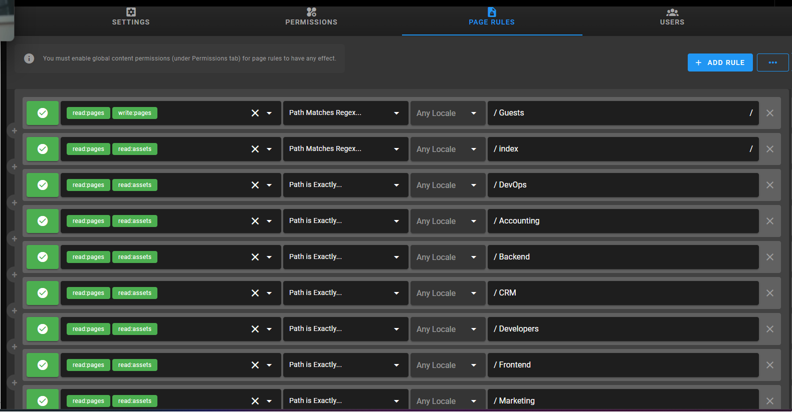

# WikiViaq Setup Guide (Step‑by‑Step Installation)

This guide walks you through installing WikiViaq on a fresh Ubuntu server from scratch. Follow each step in order.

## Prerequisites

- Ubuntu 22.04 or 24.04 (LTS recommended)
- Docker and Docker Compose installed (see official Docker docs)
- Git installed
- A domain name (e.g., `wiki.viaq.ir`) pointing to your server (optional but recommended)
- Ports `80`, `443` (if using HTTPS) and `3200` open in the firewall

## Step 1 – Clone the Repository

```bash
cd /var/www
sudo git clone https://github.com/Viaq-Platform/Wiki-Viaq.git
cd Wiki-Viaq
```

If the directory already exists, pull the latest changes:

```bash
cd /var/www/Wiki-Viaq
sudo git pull origin main
```

## Step 2 – Start Docker Containers

```bash
docker compose up -d
```

Wait for both containers (`wikijs-db` and `wikijs-app`) to become healthy. You can check with:

```bash
docker ps
```

## Step 3 – Complete the Initial Wiki.js Setup

Open your browser and go to `http://<your-server-ip>:3200` (or `http://wiki.viaq.ir:3200` if DNS is configured).  

- Select **PostgreSQL** as the database type.  
- The credentials are already pre‑filled from the environment variables in `docker-compose.yml`.  
- Create an **administrator account** (email and strong password).  
- Finish the setup wizard.

After this step, your wiki is running but contains no content yet.

## Step 4 – Obtain an API Token

The automation scripts need an API token to manage groups and imports.

1. Log in to your wiki as the administrator.
2. Go to **Administration → API Access**.
3. Click **Create Token**:
   - Name: `setup-token`
   - Permissions: grant **all** permissions for `System`, `Groups`, and `Storage`.
4. Copy the generated token string (it will not be shown again).

## Step 5 – Store the Token in `.env`

```bash
nano environments/.env
```

Replace the placeholder with your actual token:

```dotenv
API_TOKEN="eyJhbGciOiJSUzI1NiIsInR5cCI6IkpXVCJ9..."
```

Save and exit.

## Step 6 – Configure Local File System Storage

1. In the wiki admin panel, go to **Administration → Storage**.
2. Enable **Local File System**.
3. Set the **Path** to `/wiki-data` (this matches the Docker volume mount in `docker-compose.yml`).
4. Click **Apply**.

## Step 7 – Import All Markdown Files

Run the import script to synchronise the `src/en/` and `src/fa/` folders with the wiki database:

```bash
sudo bash script/import_local_files.sh
```

This will create pages for every `.md` file found. It may take a few seconds.

## Step 8 – Create Groups and Page Rules

Now create the groups (Administrators, Developers, Backend, DevOps, etc.) and set up the regex‑based access rules:

```bash
sudo bash script/setup_groups.sh
```

The script reads the folder structure under `src/en/` and optional `include_rules.json` files to define cross‑folder permissions.

## Step 9 – (Optional) Make the Home Page Public

By default, guests (not logged in) see nothing. If you want the home page to be publicly accessible:

1. Go to **Administration → Groups → Guests**.
2. Click **Create Page Rule**:
   - Action: `Allow`
   - Permissions: `Read Pages`
   - Rule Pattern: `Path Is Exactly...`
   - Rule Value: `/en/index` (or `/index` depending on your home page)
3. Save.


## Step 10 – Manually Adding Page Rules for Each Folder (if not automated)

If you are **not using the `setup_groups.sh` script** (or if the script did not create rules for some folders), you can add page rules manually to grant group access to specific folders.

For every folder inside `src/en/` (e.g., `Backend`, `DevOps`, `Frontend`, `UI-UX`, `Guests`, etc.), you should create a corresponding group (if not already present) and then add a **Path Matches Regex** rule so that group members can read/write pages under that folder.

### Example: Granting `Developers` group access to the `Backend` folder

1. Go to **Administration → Groups → Developers**.
2. Click **Create Page Rule**.
3. Configure the rule as follows:
   - **Action**: `Allow`
   - **Permissions**: `Read Pages` and `Write Pages` (if they should edit)
   - **Rule Pattern**: `Path Matches Regex`
   - **Rule Value**: `Backend`   (this will match any path containing `/Backend`)
   - **Locales**: `Any Locale` (or select specific languages)
4. Click **Save**.

Repeat this for every folder you want the group to access. For the `Administrators` group, you can use the rule value `.*` (match everything) or simply add a rule for each folder.

### Visual Example

Below is a screenshot showing an example of a **Page Rule** configuration for the `Developers` group, granting access to the `Backend` folder using regex `Backend`:



> **Note:** The image above illustrates where to click and how to fill the fields. Replace `Backend` with the actual folder name you wish to grant access to.

---

## Step 11 – Importing Markdown Content

After setting up groups and page rules, you need to import your Markdown files into the wiki. Run the import script:

```bash
sudo bash /var/www/Wiki-Viaq/script/import_local_files.sh
```

The script will:
- Send an `importAll` mutation to the wiki API.
- Live‑tail the container logs so you can monitor the import progress.
- Retry automatically if the API call fails.

After the import, you will see all your `.md` files as wiki pages under the corresponding paths (e.g., `https://wiki.viaq.ir/en/Backend`, `https://wiki.viaq.ir/en/DevOps`, etc.).

---

*For any problems, check the container logs:* `docker logs wikijs-app --tail 100`
